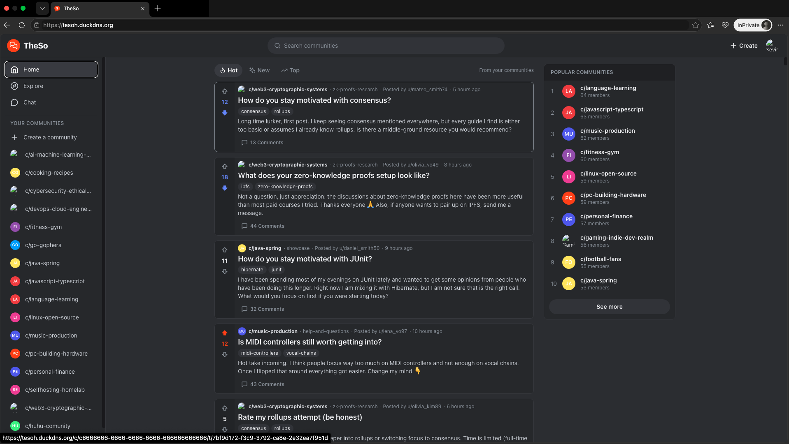
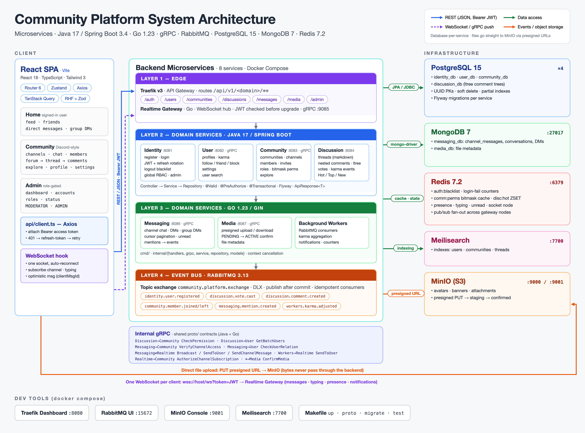
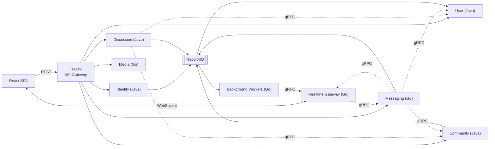

# Community-Centric Platform

**A Reddit + Discord style community platform built as polyglot microservices (Java + Go).**

  
  
  
  
  
  
  
  
  

**[🔗 Live Demo](https://tesoh.duckdns.org/)** · **[🏛️ Architecture](./docs/ARCHITECTURE.md)** · **[🗄️ Database](./docs/DATABASE.md)** · **[🌐 API](./docs/API.md)**

> **Note:** This repository contains the public documentation for the project. The source code is kept in a private repository.

---

## What is it?

A social platform centered on **communities** rather than personal feeds. It combines two well-known models:

| From Reddit | From Discord |
|---|---|
| Threads inside forum channels | Communities (servers) with categories & channels |
| Unlimited-depth nested comments | Real-time text channels |
| Upvote / downvote, Hot / Top / New ranking | Roles with bitmask permissions, private channels |
| User karma | Direct messages & group DMs, typing indicators, presence |

There is intentionally **no Facebook/Instagram-style personal feed** — content lives inside communities.

## Demo

| | |
|---|---|
| **Live demo** | https://tesoh.duckdns.org/ |
| **Demo account** | `demo@example.com` / `demo-password` |

| Community & channels | Forum threads & nested comments |
|---|---|
|  |  |
| **Real-time chat / DMs** | **Explore & search** |
|  |  |

## Key Features

- **Authentication** — register/login with short-lived JWT access tokens, rotating refresh tokens, and Redis-backed logout (token blacklist). Global RBAC for staff/admin.
- **Profiles & social graph** — profiles, karma, follow / friend / block relationships modeled directly in PostgreSQL.
- **Communities** — create/join (public or invite code), categories, text and forum channels, custom roles with Discord-style permission bitmasks, per-channel role access.
- **Discussions** — threads with markdown and attachments, nested comment trees (PostgreSQL `ltree`), voting, Hot/Top/New sorting.
- **Messaging** — channel chat and DMs / group DMs stored in MongoDB, with cursor-based infinite scroll, mentions, unread counts.
- **Real-time** — a single WebSocket per client for messages, typing, presence and notifications.
- **Media** — direct-to-storage uploads via presigned URLs (MinIO / S3 compatible).
- **Search** — full-text search of users, communities and threads with Meilisearch.
- **Background processing** — karma calculation, notifications and counters handled asynchronously by Go workers.
- **Admin dashboard** — account management for staff roles.

## Architecture at a Glance

- **8 services**, each owning its own database (**database-per-service**).
- **gRPC** for synchronous service-to-service calls, **RabbitMQ** for domain events.
- **One WebSocket** connection per client to the Realtime Gateway; backends push live events through it via gRPC.

Read the full design in **[ARCHITECTURE.md](./docs/ARCHITECTURE.md)**.

## Tech Stack

| Area | Technology |
|---|---|
| Java services | Java 17, Spring Boot 3.4, Spring Security 6, Spring Data JPA, Flyway |
| Go services | Go 1.23, Gin, gorilla/websocket, mongo-driver |
| Communication | gRPC + Protocol Buffers (sync), RabbitMQ topic exchange (async) |
| Gateway | Traefik v3 |
| Databases | PostgreSQL 15 (one DB per service), MongoDB 7 |
| Cache / realtime state | Redis 7 |
| Search | Meilisearch |
| Object storage | MinIO (S3 compatible) |
| Frontend | React 18, TypeScript, Vite, TailwindCSS, Zustand, TanStack Query, React Hook Form + Zod |
| Infrastructure | Docker, Docker Compose |
| Testing | JUnit 5, Mockito, Spring Boot Test, Go `testing` |

## Services

| Service | Language | Responsibility | Storage |
|---|---|---|---|
| `identity-service` | Java | Accounts, login, JWT, refresh tokens, global roles | PostgreSQL, Redis |
| `user-service` | Java | Profiles, karma, social graph, settings | PostgreSQL, Meilisearch |
| `community-service` | Java | Communities, channels, members, roles, permissions | PostgreSQL, Redis, Meilisearch |
| `discussion-service` | Java | Threads, nested comments, votes, ranking | PostgreSQL, Redis, Meilisearch |
| `messaging-service` | Go | Channel messages, DMs, conversations | MongoDB, Redis |
| `media-service` | Go | Upload / download of files via presigned URLs | MongoDB, MinIO |
| `realtime-gateway` | Go | WebSocket connections, fan-out, presence | Redis |
| `background-workers` | Go | Karma, notifications, counters (event consumers) | Redis |

## Documentation

| Document | Contents |
|---|---|
| [ARCHITECTURE.md](./docs/ARCHITECTURE.md) | System design, service boundaries, communication patterns, key flows, security |
| [DATABASE.md](./docs/DATABASE.md) | ER diagrams of every database, MongoDB collections, Redis key design |
| [API.md](./docs/API.md) | REST endpoints, WebSocket events, internal gRPC methods |

## Author

**Your Name** — [GitHub](https://github.com/your-username) · [LinkedIn](https://linkedin.com/in/your-profile) · your-email@example.com
