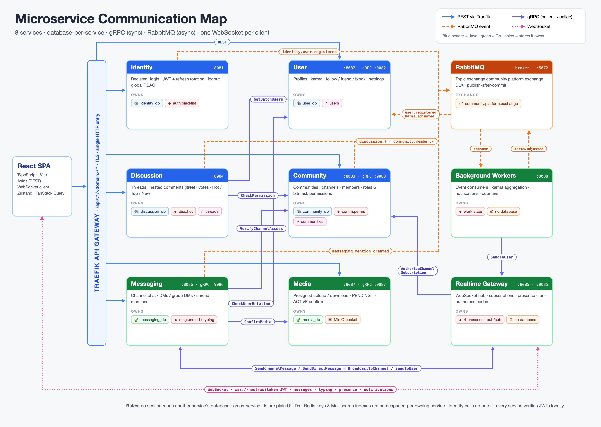
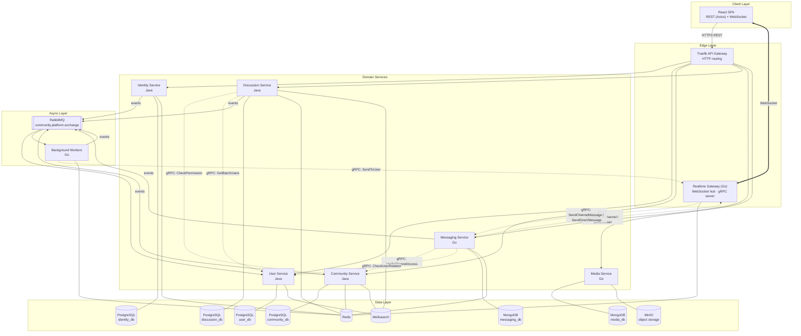
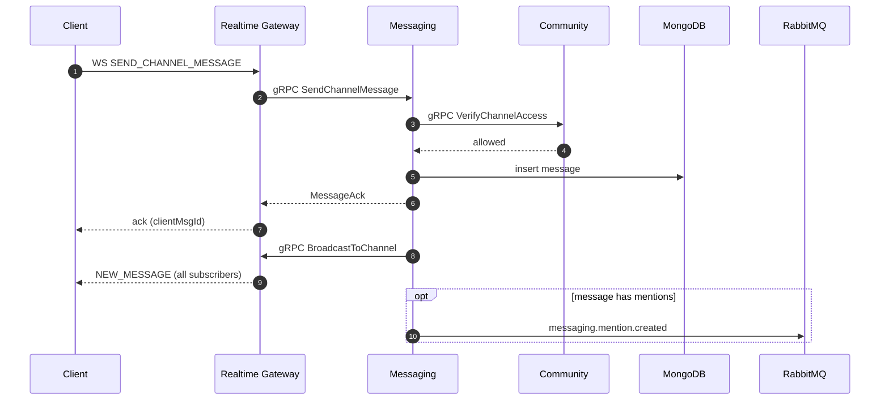
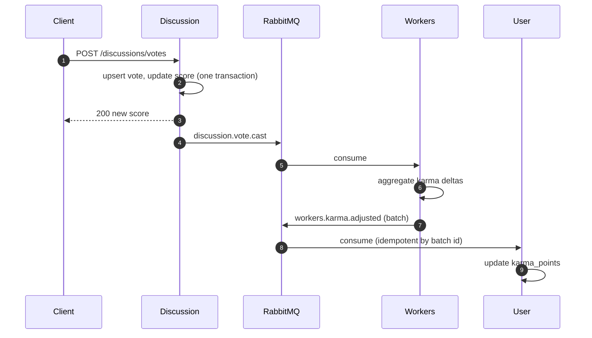
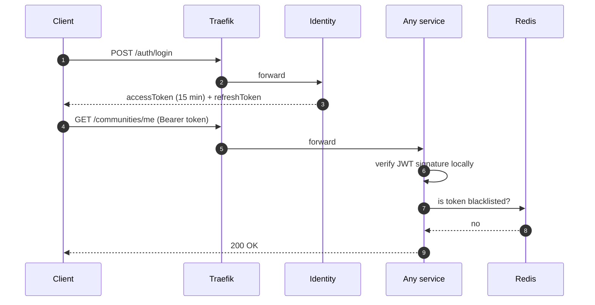

# System Architecture

This document explains how the platform is structured, how services talk to each other, and why it was designed this way.

---

## 1. Design Principles

1. **Database-per-service.** Every service owns its data. No service reads or writes another service's database — data is shared only through APIs or events.
2. **Explicit communication boundaries.** Not every service talks to every other. Only services with a real business dependency are connected, and each connection is a documented gRPC contract or event.
3. **Right tool per workload.** Java/Spring Boot for transactional domain logic; Go for high-concurrency I/O (chat, WebSockets, uploads, workers).
4. **Sync only when the user is waiting.** gRPC is used when an answer is needed immediately (e.g. "can this user post here?"). Everything else is an asynchronous event.
5. **Soft delete & auditability.** Every table/collection carries `status`, `created_at`, `updated_at`, `deleted_at`.

---

## 2. High-Level View

---

## 3. Services

| Service | Role | Inbound | Outbound |
|---|---|---|---|
| **Traefik** | Single HTTP entry point; routes `/api/v1/<domain>/**` to services | HTTP (client) | HTTP to services |
| **Identity** | Registration, login, JWT issuing, refresh-token rotation, logout, global RBAC | REST | Event `user.registered` |
| **User** | Profiles, karma, follow/friend/block graph, user settings, user search | REST, gRPC, events | — |
| **Community** | Communities, categories, channels, members, roles, permission bitmasks, explore | REST, gRPC | Event `community.member.joined/left` |
| **Discussion** | Threads, nested comments, votes, Hot/Top/New ranking, thread search | REST | gRPC → Community, User · Events |
| **Messaging** | Channel messages, DMs & group DMs, conversation list, unread counts | REST, gRPC | gRPC → Community, User, Realtime · Events |
| **Media** | Presigned upload/download URLs, upload confirmation, file metadata | REST, gRPC | MinIO |
| **Realtime Gateway** | Holds all WebSocket connections, channel subscriptions, presence, typing | WebSocket, gRPC | gRPC → Messaging, Community |
| **Background Workers** | Consume domain events: karma, notifications, counters | RabbitMQ | gRPC → Realtime · Events |

### Internal structure

- **Java services** follow a layered design: `Controller → Service → Repository → Database`. Controllers only validate and delegate; business rules live in services; failures are thrown as typed error codes and mapped to a uniform JSON envelope by a global exception handler.
- **Go services** follow the standard Go layout: `cmd/` (wiring), `internal/handlers` (HTTP/WS), `internal/grpc`, `internal/service` (business logic), `internal/repository`, `internal/models`. All goroutines honor context cancellation.
- Shared contracts live in a central `proto/` directory and are generated for both Java and Go.

---

## 4. Communication Patterns

### 4.1 Synchronous — gRPC

Used only where the caller needs an immediate answer.

| Caller → Callee | Method | Why |
|---|---|---|
| Discussion → Community | `CheckPermission` | Can this user create a thread/comment in this channel? |
| Discussion → User | `GetBatchUsers` | Resolve author names/avatars for a page of threads/comments in one call |
| Messaging → Community | `VerifyChannelAccess` | Is the user allowed to read/post in this (possibly private) channel? |
| Messaging → User | `CheckUserRelation` | Is the DM blocked? |
| Messaging → Realtime | `BroadcastToChannel`, `SendToUser` | Push a persisted message to online clients |
| Realtime → Messaging | `SendChannelMessage`, `SendDirectMessage` | Messages sent over the WebSocket are persisted by Messaging |
| Realtime → Community | `AuthorizeChannelSubscription` | Check access before subscribing a socket to a channel |
| Workers → Realtime | `SendToUser` | Deliver notifications to online users |
| Any → Media | `GetMedia`, `ConfirmMedia`, `GetDownloadUrl`, `DeleteMedia` | Attach uploaded files to threads/messages |

**Not connected on purpose:** Identity calls no one (other services validate JWTs locally). Community never calls Discussion or Messaging. User never calls back into Community or Discussion. This keeps the dependency graph acyclic at the domain level.

### 4.2 Asynchronous — RabbitMQ

All events go through one topic exchange, `community.platform.exchange`, with a dead-letter exchange for failed messages.

| Producer | Routing key | Consumer | Purpose |
|---|---|---|---|
| Identity | `identity.user.registered` | User | Create the default profile & settings for a new account |
| Discussion | `discussion.vote.cast` | Workers | Recompute author karma and Hot ranking |
| Discussion | `discussion.comment.created` | Workers | Notify the thread/comment author |
| Community | `community.member.joined` / `.left` | Workers | Member counters, audit |
| Messaging | `messaging.mention.created` | Workers | Notify mentioned users |
| Workers | `workers.karma.adjusted` | User | Apply karma deltas in idempotent batches |

Events are published only after the database transaction commits, and consumers are idempotent, so retries never double-apply changes.

### 4.3 Real-time — WebSocket

- The client opens **one** connection: `wss://<host>/ws?token=<JWT>`. The token is validated **before** the HTTP upgrade.
- Frames share one envelope: `{ "event": "...", "channelId": "...", "payload": { ... } }`.
- Multiple gateway instances coordinate through Redis (presence, socket-node mapping, pub/sub), so the gateway scales horizontally.

---

## 5. Key Flows

### Sending a channel message

### Voting and karma

### Login and authenticated requests

### File upload

1. Client asks Media for a presigned upload URL.
2. Client uploads the file **directly** to object storage (no file bytes go through the backend).
3. Client sends the returned media id with the thread/message; the owning service confirms it via gRPC `ConfirmMedia`, moving it from staging to active.

---

## 6. Security

- **Tokens:** short-lived JWT access tokens (15 min) + refresh tokens stored hashed in `identity_db` with rotation on every refresh.
- **Logout / revocation:** revoked access tokens are hashed into a Redis blacklist with TTL equal to the token's remaining lifetime; every service checks it.
- **Stateless verification:** each service validates JWT signatures locally — Identity is not on the hot path of every request.
- **Authorization:** global roles (user / moderator / admin) via RBAC; community-level permissions via role bitmasks, cached in Redis per `(community, user)`.
- **Passwords:** BCrypt hashing; brute-force protection via login-failure counters in Redis.
- **Secrets:** read from environment variables only.
- **Errors:** clients receive a uniform `{ code, message, result }` envelope — never stack traces.

---

## 7. Data Storage Choices

| Need | Choice | Reason |
|---|---|---|
| Accounts, communities, threads | PostgreSQL | Strong consistency, relations, transactions |
| Nested comments | PostgreSQL `ltree` | Load an entire comment subtree with one indexed query |
| Social graph | PostgreSQL composite keys + 2-way indexes | Simple and fast for follow/block lookups; no graph DB needed |
| Chat messages, media metadata | MongoDB | High write volume, flexible documents, time-ordered pagination |
| Presence, typing, rankings, caches | Redis | Sub-millisecond reads, TTLs, sorted sets, pub/sub |
| Search | Meilisearch | Typo-tolerant full-text search for users, communities, threads |
| Files | MinIO (S3 API) | Presigned direct uploads, cheap storage |

Details: **[DATABASE.md](./DATABASE.md)**.

---

## 8. Deployment

- Everything runs as containers with **Docker Compose** (services + PostgreSQL, MongoDB, Redis, RabbitMQ, Meilisearch, MinIO, Traefik) with health checks and ordered startup.
- Database migrations are versioned (Flyway for Java services, migration scripts for Go services) and run on startup.
- Stateless services (all except the databases) can be scaled horizontally; the Realtime Gateway scales through Redis coordination.
