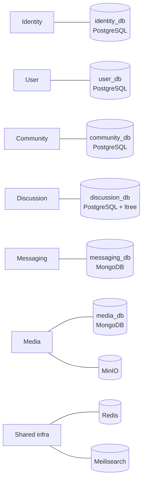
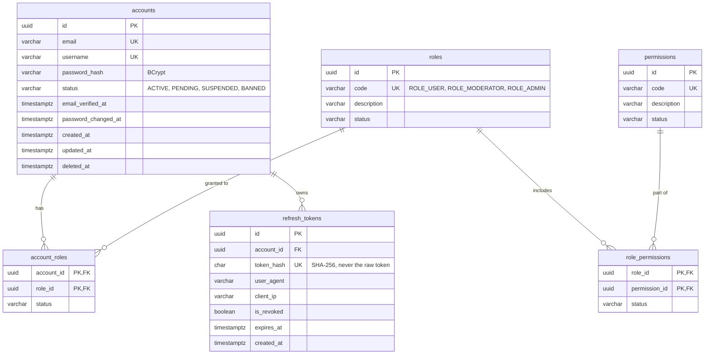
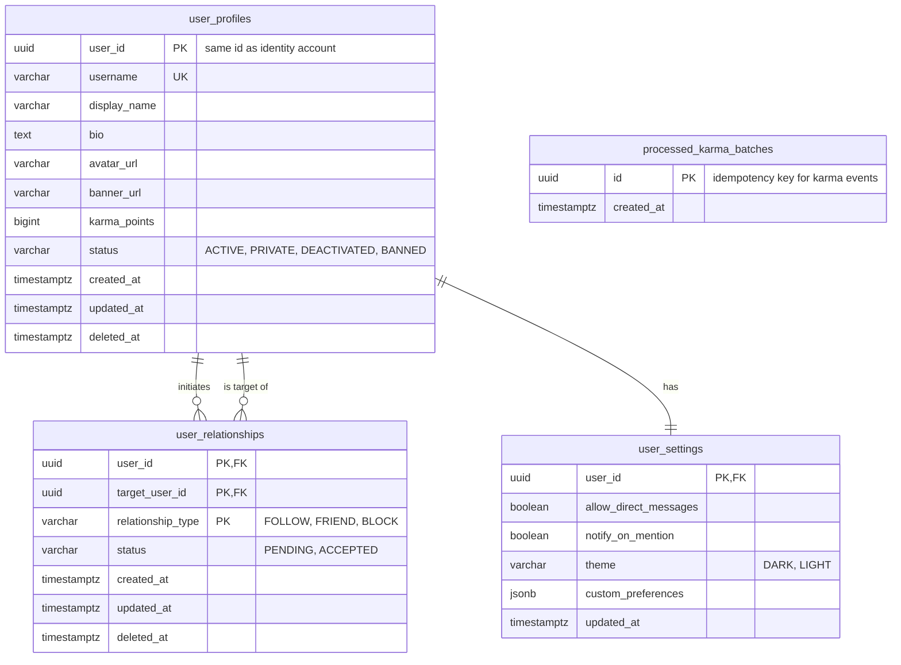
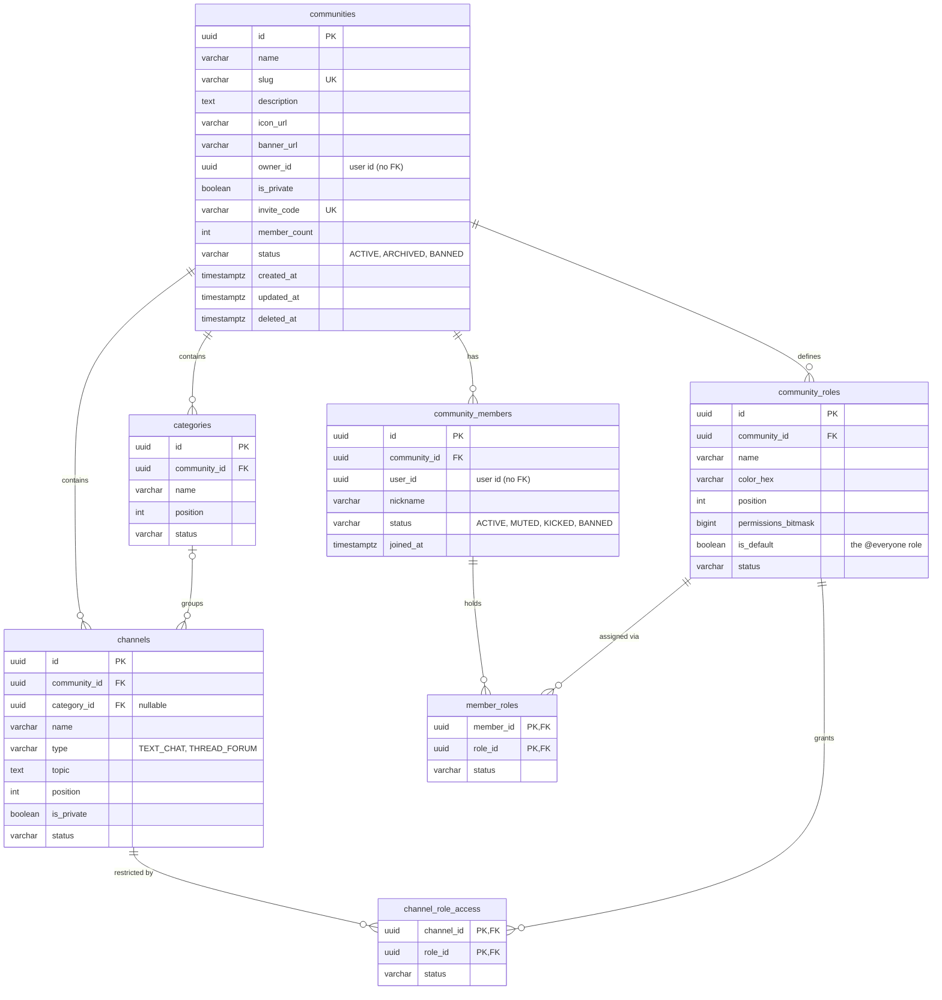
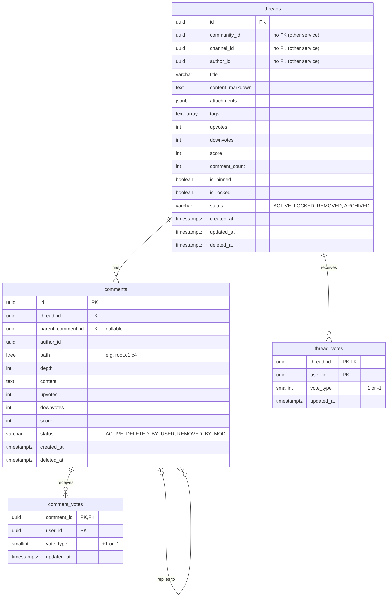
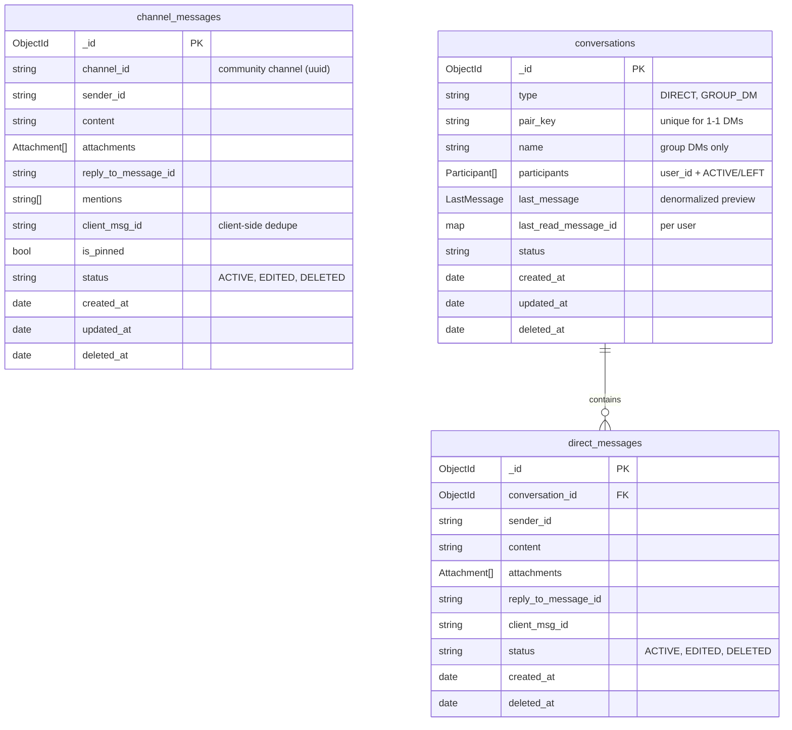
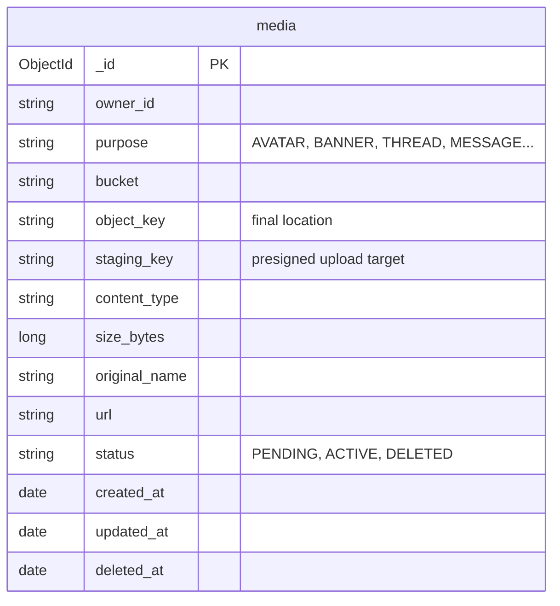

# Database Design

The platform follows **database-per-service**: each service owns its own database and no service queries another's. Cross-service references (e.g. `author_id` in a thread) are plain UUIDs, not foreign keys — consistency between services is kept through APIs and events.

## Conventions

- **Primary keys:** UUID (`uuid_generate_v4()`) in PostgreSQL; `ObjectId` in MongoDB. UUIDs avoid ID enumeration and ease future sharding.
- **Audit & soft delete:** every table/collection has `status`, `created_at`, `updated_at`, `deleted_at`. Reads always filter `deleted_at IS NULL`.
- **Partial indexes:** unique and lookup indexes are declared `WHERE deleted_at IS NULL`, so a soft-deleted row never blocks a new one (e.g. re-using a username).
- **Naming:** `snake_case` columns; Java/Go fields map to them.
- **Migrations:** versioned and applied on service startup.

---

## 1. Identity — `identity_db` (PostgreSQL)

Accounts, credentials, sessions and global role-based access control.

**Notes**
- Email and username are unique case-insensitively (`lower(...)`) among non-deleted accounts.
- Only a hash of each refresh token is stored; tokens are rotated on every refresh. `password_changed_at` lets services reject tokens issued before a password change.

---

## 2. User — `user_db` (PostgreSQL)

Public profiles, karma, social graph and user preferences. A profile shares its id with the identity account and is created from the `user.registered` event.

**Notes**
- **Social graph in PostgreSQL:** composite PK `(user_id, target_user_id, relationship_type)` plus indexes in both directions make "who do I follow", "who follows me" and "is X blocked" index-only lookups — no graph database required.
- `processed_karma_batches` records already-applied karma batches so redelivered events are ignored.

---

## 3. Community — `community_db` (PostgreSQL)

Discord-style structure: communities, categories, channels, members, roles and channel access.

**Notes**
- **Permissions as a bitmask:** each role stores a 64-bit mask (view, send messages, create threads, manage channels, manage roles…). A member's effective permissions are the OR of all their roles; the result is cached in Redis.
- **Private channels:** visible only to roles listed in `channel_role_access`.
- `(community_id, user_id)` is unique among active members. A discovery index on `(is_private, status, member_count DESC)` powers the Explore page.

---

## 4. Discussion — `discussion_db` (PostgreSQL + `ltree`)

Reddit-style threads, nested comments and votes.

**Notes**
- **Comment trees with `ltree`:** every comment stores its full ancestor path. A GiST index on `path` lets the service fetch a whole thread's tree, or any subtree (`path <@ 'root.c1'`), in one query, already ordered for rendering.
- Deleted comments are soft-deleted so replies under them remain intact (shown as "[deleted]").
- **One vote per user per target** is guaranteed by the composite primary key; changing a vote is an upsert, and counters are updated in the same transaction.
- A composite index on `(community_id, channel_id, score DESC, created_at DESC)` serves Top/New listings; Hot ranking is served from a Redis sorted set.

---

## 5. Messaging — `messaging_db` (MongoDB)

Channel chat and direct messages. MongoDB fits the append-heavy, time-ordered access pattern.

**Indexes**

| Collection | Index | Used for |
|---|---|---|
| `channel_messages` | `{ channel_id: 1, created_at: -1 }` | Channel history, cursor pagination |
| `channel_messages` | `{ channel_id: 1, is_pinned: 1 }` | Pinned messages |
| `conversations` | `{ "participants.user_id": 1, updated_at: -1 }` | Inbox ordered by latest activity |
| `conversations` | `{ pair_key: 1 }` (unique, partial) | At most one 1-1 DM per pair of users |
| `direct_messages` | `{ conversation_id: 1, created_at: -1 }` | DM history |

`client_msg_id` makes sending idempotent: a client retry after a network drop never creates a duplicate message.

---

## 6. Media — `media_db` (MongoDB + MinIO)

File metadata lives in MongoDB; the bytes live in MinIO (S3 compatible).

Lifecycle: `PENDING` (presigned URL issued) → `ACTIVE` (owning service confirmed it) → `DELETED`. Unconfirmed uploads can be cleaned up from staging.

---

## 7. Redis Key Design

One Redis instance, namespaced by service prefix.

| Owner | Key pattern | Type | TTL | Purpose |
|---|---|---|---|---|
| Identity | `auth:blacklist:{token_hash}` | String | token's remaining life | Revoked access tokens (logout) |
| Identity | `auth:login_fails:{email}` | Counter | 15 min | Brute-force protection |
| Community | `comm:perms:{community_id}:{user_id}` | String (int64 mask) | 30 min | Cached effective permissions |
| Discussion | `disc:hot:{channel_id}` | Sorted set | 24 h | Hot/Trending ranking |
| Messaging | `msg:typing:{channel_id}:{user_id}` | String | 3–5 s | Typing indicator |
| Messaging | `msg:unread:{channel_id}:{user_id}` | Counter | 7 days | Unread counts |
| Realtime | `rt:presence:{user_id}` | String | 60 s (heartbeat) | Online / idle status |
| Realtime | `rt:socket_node:{user_id}` | String | 120 s | Which gateway node holds the user's socket |
| Realtime | `rt:pubsub:channel:{channel_id}` | Pub/Sub | — | Fan-out across gateway nodes |

Eviction policy is LRU, so Redis degrades gracefully under memory pressure — it is only ever a cache or ephemeral state, never the source of truth.

---

## 8. Search Indexes (Meilisearch)

| Index | Owner | Fed from |
|---|---|---|
| `users` | User | Profile create / update |
| `communities` | Community | Public community create / update |
| `threads` | Discussion | Thread create / update / delete |

Each service keeps its own index in sync with its own database.
